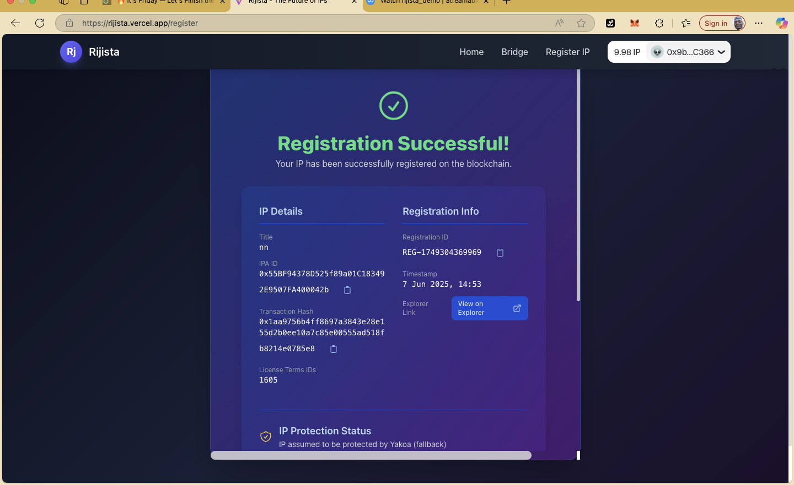
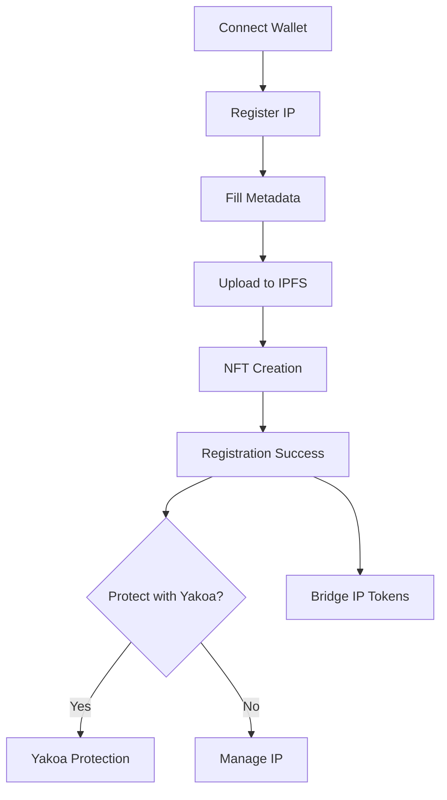

# Rijista: Empowering Music Creators with Blockchain IP Protection

---

> **Innovate. Protect. Earn.**

---

## 🎵 What is Rijista?

**Rijista** is a cutting-edge platform designed for musicians and creators to securely register, manage, and protect their music intellectual property (IP) on the blockchain. Leveraging the power of decentralized technology, Rijista ensures your creative assets are safe, verifiable, and ready for the future of digital rights management.

---

## 🚩 The Problem

- Traditional music IP registration is **complex, slow, and expensive**
- Creators face **infringement risks** and lack of transparent ownership proof
- Managing and tracking music rights is **fragmented** and **non-interactive**

---

## 🚀 The Rijista Solution

- **One-click blockchain registration** for your music IP
- **Immutable proof of ownership** and automated royalty tracking
- **Seamless integration** with Story Protocol, Tomo Wallet, Yakoa Protection, and DeBridge
- **User-friendly, interactive interface** for creators of all backgrounds

---

## 🛠️ How to Use Rijista

1. **Visit:** [https://rijista.vercel.app/](https://rijista.vercel.app/)
2. **Connect your wallet:**
   - Click the `Connect Wallet` button in the top right corner
   - Approve the connection in your Web3 wallet (MetaMask, Tomo, etc.)
3. **Register your music IP:**
   - Click `Register IP` in the header
   - Complete the registration form:
     - **Title**: Name your music asset
     - **Description**: Describe your work
     - **Creator Name & Address**: Auto-filled from your wallet
     - **Image URL**: (Optional) Add cover art
   - Follow the on-screen prompts to complete all **four steps**:
     1. IP Metadata
     2. NFT Metadata
     3. IPFS Upload
     4. NFT Creation
   - On success, you'll see a **Registration Successful!** screen with your asset details

*Figure 1: Step-by-step registration process in Rijista*

---

## 🛡️ Enhance Your Protection with Yakoa

- After registration, click `Protect with Yakoa` to enable advanced IP protection:
  - **Automated detection** of unauthorized content reuse
  - **Real-time validation** of brand authorizations
  - **AI-powered originality detection**
- Confirm the action and wait for processing
- Once complete, your asset will display **Yakoa Protection Details**

---

## 🔄 Bridge & Get IP Tokens

- Need IP tokens? Use the built-in **Bridge** feature:
  1. Click `Bridge` in the header
  2. Wait for the widget to load
  3. Select your source network (e.g., ETH, BNB)
  4. Choose `IP` as the destination asset
  5. Enter the amount and confirm the transaction
- Enjoy seamless cross-chain swaps and instant access to IP tokens

---

## 🌈 Key Features & Integrations

- **Modern UI**: Built with React, TypeScript, and Tailwind CSS for a beautiful, responsive experience
- **Blockchain Security**: Powered by Story Protocol and Ethereum smart contracts
- **Wallet Integration**: Native support for Tomo Wallet and MetaMask
- **IPFS Storage**: Decentralized, tamper-proof asset storage via Pinata
- **Yakoa API**: Advanced IP protection and infringement detection
- **DeBridge**: Effortless cross-chain asset bridging

---

## 📊 Interactive Workflow Diagram

---

## 📝 Example Screens (for PDF/Slides)

- **Landing Page:** Protect Your Music on the Blockchain
- **Registration Form:** Step-by-step guided input
- **Success Screen:** Registration details, explorer links, and protection options
- **Bridge Widget:** Swap assets across networks

---

## 💡 Why Rijista Stands Out

- **End-to-end music IP management** in one platform
- **Professional, accessible, and visually engaging**
- **Open source, community-driven, and future-ready**

---

## 📚 Resources & Support

- [Project README](./README.md)
- [Project Website](https://rijista.vercel.app/)

---

> Built with ❤️ for the decentralized music IP ecosystem. Join the revolution! 

> Made with ❤️ by Ibrahim @iabdulkarim472 